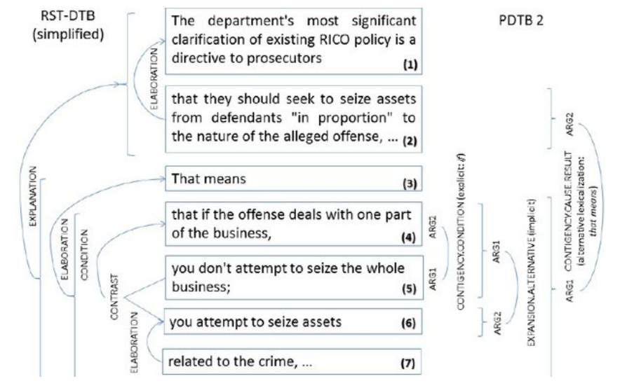
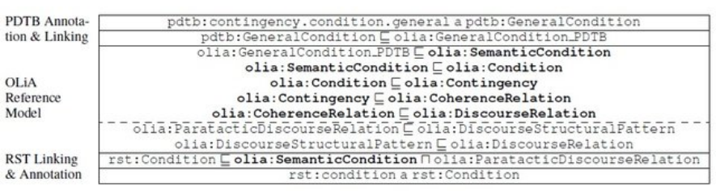

The **OLiA Discourse Extensions** extend the [Ontologies of Linguistic
Annotation (OLiA)](http://purl.org/olia) with respect to **discourse
features**. The OLiA ontologies provide a a terminology repository that
can be employed to facilitate the conceptual (semantic) interoperability
of annotations of discourse phenomena as found in important corpora
available to the community.

1.  [OLiA Discourse Extensions](#background) \[[Reference Model
    fragment](http://purl.org/olia/discourse/olia_discourse.owl)
    (OWL2/DL), [provisional Linking with OLiA Reference
    Model](http://purl.org/olia/discourse/olia_discourse-link.rdf)
    (OWL2/DL)\]
2.  [Discourse Structure Annotation](#discourse)
    \[[background](#discourse.background),
    [ontologies](#discourse.ontologies)\]
3.  [Anaphora, Information Status and Information Structure](#is)
    \[[background](#is.background), [ontologies](#is.ontology)\]

# OLiA Discourse Extensions {#background}

We descrone the extension of the Ontologies of Linguistic
Annotation (OLiA) with respect to **discourse
features**. The OLiA ontologies provide a a terminology repository that
can be employed to facilitate the conceptual (semantic) interoperability
of annotations of discourse phenomena as found in important corpora
available to the community, including the [RST Discourse
Treebank](http://catalog.ldc.upenn.edu/LDC2002T07) and the [Penn
Discourse Treebank](http://catalog.ldc.upenn.edu/LDC2008T05). Note that
the current ontologies are chosen such that they represent **typical
phenomena**, they are, however, by no means exhaustive with respect to
available *corpora*.

Discourse phenomena considered here include

-   anaphora („coreference")
-   information status („given-new")
-   information structure („topic-focus")
-   discourse structure (hierarchical, semantic organization of texts
    and other discourses)
-   discourse relations (semantic relations holding between different
    segments of a text, resp. their underlying semantic representations)

The OLiA ontologies do currently not cover dialogue structure, Gricean
and Post-Gricean pragmatics and speech act theory or annotation schemes
developed on this basis. In a broad sense, these can be regarded
discourse phenomena, as the distinction between discourse and pragmatics
is largely underdefined.

Instead, we follow a pragmatic distinction based on the types of
available annotations: We restrict ourselves to the annotation of text
(no dialogues, hence), with a particular focus on theories of discourse
structure and discourse relations (in the sense of the [Rhetorical
Structure Theory](http://www.sfu.ca/rst) or the [Segmented Discourse
Representation
Theory](http://homepages.inf.ed.ac.uk/alex/papers/iwcs4.pdf)) and
frequently annotated phenomena most often discussed in regard to this
(hence, anaphora, information status and information structure). Further
extensions are, however, envisioned.

At the moment, the OLiA ontologies cover 9 annotation schemes for the
annotation of coreference, information status, information structure and
discourse structure for a broad variety of languages. So far, 8 of these
are provided on this site. A full publication is planned for Jan 2014.
All of these annotation schemes are formalized as self-contained OWL/DL
ontologies (Annotation Models), with a declarative linking (Linking
Models) linking them to an ontology that provides a generalized
vocabulary for discourse annotation (Reference Model). For the latter
aspects, we currently provide two ontologies that will subsequently be
integrated with the [OLiA Reference
Model](http://purl.org/olia/olia.owl) (cf. provisional linking:
[provisional Linking with OLiA Reference
Model](http://purl.org/olia/discourse/olia_discourse-link.rdf)).

PS: Note that this site is currently being updated, the publication of
further Annotation Models and an update of the Reference Models is in
preparation.

## Discourse Structure Annotation {#discourse}

### Background {#discourse.background}

Different theories of discourse structure emerged in the past decades,
and different models of annotation have been developed, accordingly, as
illustrated for two alternative annotations of the same sentence in the
figure below.

\
**Fig. 1. Comparing Discourse Structure Annotations (RST Discourse Treebank and
Penn Discourse Treebank, file wsj_1365 (simplified)**

With traditional annotation schemes, these annotations can hardly be put
in any relation to each other, because different structures are
involved: The RST annotation is based on trees, whereas the PDTB
annotation is based on relational structures. Yet, grouping together
relations on the basis of the utterances they spann across, pairs of
relations can be formed:

| | PDTB | |  RST |
| --- | -- | -- | -- |
| (4)-(5) | CONTINGENCY.Condition.general               | (4)-(5-7) |    CONDITION |
| (2)-(4-7) |  CONTINGENY.Cause.result                   | (1-2)-(3-7) |   EXPLANATION |
| (4-5)-(6) |  EXPANSION.Alternative.chosen alternative |  (5)-(6-7)|     CONTRAST |

Yet, within their annotation schemes, the relations cannot be directly
compared, for, e.g., the PDTB CONDITION and the RST CONDITION have
different connotations in terms of discourse structure (no restrictions
in PDTB, a hierarchical structure in RST). Using the ontologies, these
aspects of information can be distangled (common properties in terms of
the Reference Model in bold):

\
**Fig 2. Comparing CONDITIONs**

### Ontologies {#discourse.ontologies}

<table>
<tr>
  <th>Model</td>
  <th>Description</th>
  <th>Phenomenon</th>
  <th>OWL/DL models</th> </tr>
<tr>
  <td>Reference Model</td>
  <td>Reference Model fragment for discourse structure and discourse relations, to be integrated with <a>the OLiA Reference Model</a></td>
  <td>discourse structure, discourse relations, information structure, information status, coreference</td>
  <td><a>OLiA Discourse Extensions Model</a>, <a>Provisional Reference Model linking</a></td> </tr>
<tr>
  <td>RST Annotation Modell</td>
  <td>Annotation Model for RST (<a>http://www.sfu.ca/rst/, English, French, Portuguese, Spanish)</a></td>
  <td>discourse structure, discourse relations</td>
  <td><a>Annotation Model</a>, <a>Linking Model</a> </td> </tr>
<tr>
  <td>RSTDTB Annotation Model</td>
  <td>Annotation Model for the RST Discourse Treebank (English, Wallstreet Journal)</a></td>
  <td>discourse structure, discourse relations</td>
  <td><a>Annotation Model</a>, <a>Linking Model</a> </td> </tr>
<tr>
  <td>PDTB Annotation Model</td>
  <td>Annotation Model for the Penn Discourse Treebank (English, Wallstreet Journal), also applicable to PDTB-derivatives for Turkish, Hindi, Italian and Chinese</a></td>
  <td>discourse relations</td>
  <td><a>Annotation Model</a>, <a>Linking Model</a></td> </tr>
<tr>
  <td>PDGB Annotation Model</td>
  <td>Annotation Model for the Penn Discourse Graphbank (English, incl. Wallstreet Journal)</a></td>
  <td>discourse relations</td>
  <td><a>Annotation Model</a>, <a>Linking Model</a></td> </tr>
<tr>
  <td>Knott Annotation Model</td>
  <td>Annotation Model for the Knott (1996) discourse cue taxonomy (not used for corpus annotation, but for cue word classification, such discourse cues have been annotated in PDTB, though)</a></td>
  <td>discourse (relation) marker taxonomy</td>
  <td><a>Annotation Model</a>, no Linking Model yet</td> </tr> 
</table> 

## Anaphora, Information Status and Information Structure {#is}

### Background {#is.background}

Whereas discourse structure and discourse relations are particularly
relevant with respect to the global structure of a discourse, the
phenomena considered here refer to discourse phenomena as manifested
within the utterance that reflect the influence of the surrounding
(especially preceding) discourse.

Information Structure deals with the structure of utterances in terms of
what kind of information they provide: The topic is the part of an
utterance that it is *about*, the focus provides *new information* about
the topic, and both are often (but not exclusively) seen in as
dichothomy. The terminological development of information structure has,
however, not progressed to an extent that fully compatible definitions
are employed.

Information Status refers to the degree that an entity is familiar
(\`given\') to the hearer, as reflected in the choice of referring
expressions: A given referent is often realized as a pronoun (albeit it
doesn\'t have to be), an unknown referent is usually introduced by an
indefinite NP, its full name, a longish description or a marked
construction such as an \`indefinite *this*\'. Different realization
options are available between these extremes, e.g., definite
descriptions and names with different degree of informativity and
complexity. Information Status annotation aims at classifying referring
expressions accordingly.

A given referent is typically anaphorically anchored in the preceding
text, i.e., it co-refers with another expression that was previously
mentioned. Coreference annotations aim at marking these anaphoric links
between markables in the text. However, a referent doesn\'t have to be
explicitly mentioned before to be familiar to the hearer, bridging
inferences from a related entity (trigger) in the preceding text may be
sufficient, and anaphora annotation has been extended to bridging
annotations, accordingly.

For both anaphora annotation and information structure/status
annotation, different schemes have been developed, some of which are
formalized here together with a generalizing Reference Model fragment.

### Ontologies {#is.ontology}

<table>
<tr>
  <th>Model</td>
  <th>Description</th>
  <th>Phenomenon</th>
  <th>OWL/DL models</th> </tr>
<tr>
  <td>Reference Model</td>
  <td>Reference Model fragment, to be integrated with <a>the OLiA Reference Model</a></td>
  <td>discourse structure, discourse relations, information structure, information status, coreference</td>
  <td><a>OLiA Discourse Extensions model</a>, <a>Provisional Reference Model linking</a></td> </tr>
<tr>
  <td>CRC632</td>
  <td>Annotation Model for the corpora of the Collaborative Research Center (SFB) 632, "Information Structure" (Potsdam, Berlin, Germany), applied to various, typologically different languages</td>
  <td>information structure, information status</td>
  <td><a>Annotation Model</a>, <a>Linking Model</a></td> </tr>
<tr>
  <td>DIRNDL</td>
  <td>Annotation Model for the DIRNDL corpus (German, spoken language)</td>
  <td>information status, coreference</td>
  <td><a>Annotation Model</a>, <a>Linking Model</a> </td> </tr>
<tr>
  <td>PoCoS</td>
  <td>Annotation Model for the Potsdam Coreference Scheme, applied to English, German and Russian</td>
  <td>coreference</td>
  <td><a>Annotation Model</a>, <a>Linking Model</a></td> </tr>
<tr>
  <td>ARRAU</td>
  <td>Annotation Model for the ARRAU corpus (English)</td>
  <td>coreference, bridging</td>
  <td><a>Annotation Model</a>, <a>Linking Model</a></td> </tr>
<tr>
  <td>TüBa-D/Z</td>
  <td>Annotation Model for the TüBa-D/Z corpus (German)</td>
  <td>coreference</td>
  <td><a>Annotation Model</a></td> </tr>
</table> 

