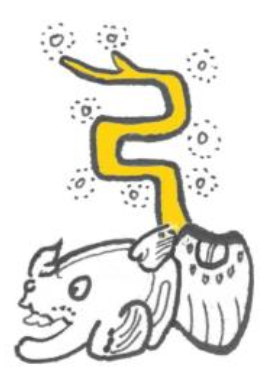
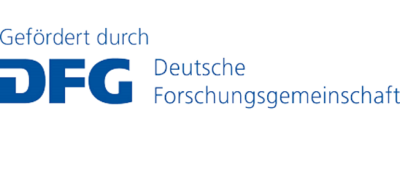
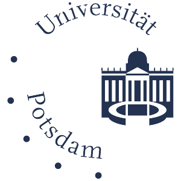
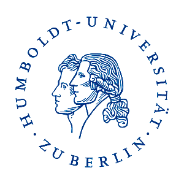
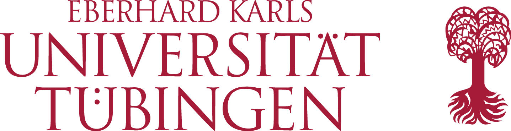
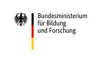
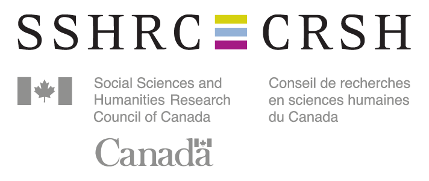
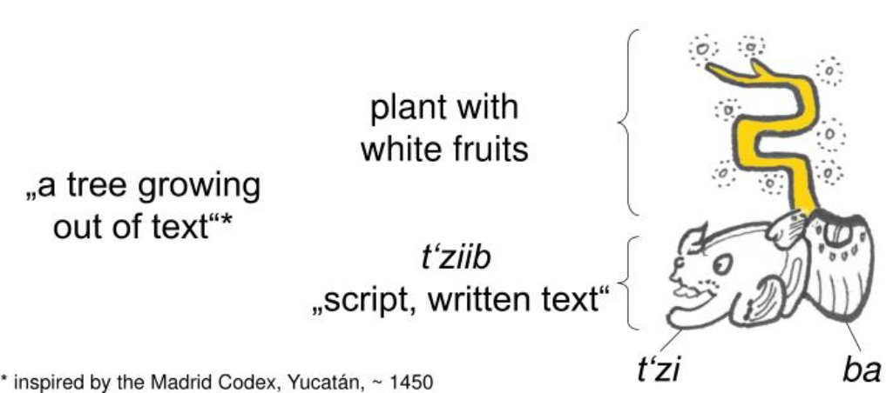

# Ontologies of Linguistic Annotation (OLiA)

The **Ontologies of Linguistic Annotation (OLiA)** are a repository of
linguistic data categories used for

-   corpus annotation,
-   Natural Language Processing (NLP) tools,
-   machine-readable dictionaries,
-   and other linguistic resources

They formalize application-specific terms (e.g., an annotation scheme)
as OWL2/DL ontologies, and provide a declarative linking with an
application-independent **Reference Model** that then serves as a
mediator to different community-maintained terminology repositories such
as GOLD and ISOcat. In this function, they will serve as a central hub
for linguistic data categories within the emerging [Linguistic Linked
Open Data (LLOD) cloud](http://linguistic-lod.org). OLiA
provides Annotation Models for linguistic annotations and NLP tools for
**more than 85 languages** together with their linking to a common
**Reference Model** that provides their respective terms and concepts.

The OLiA ontologies are being developed at the [Applied Computational
Linguistics (ACoLi) Lab at the Goethe University Frankfurt,
Germany](http://www.acoli.informatik.uni-frankfurt.de/). Earlier
development took place in the context of Collaborative Research Center
\"Linguistic Data Structures\", (SFB 441/C2) in a collaborative effort
of the universities of Tübingen, Hamburg, Potsdam, HU Berlin
(2005-2008), and subsequently, at the Collaborative Research Center
\"Information Structure\" (SFB 632/D1) with participation of the
University Potsdam and the Humboldt-University Berlin (since 2007). The
original goal was to document and to formalize linguistic categories for
all language resources of the linguistic collaborative research centers
existing in Germany at the time. Documents describing the [original motivation (2007)](motivation.html) and the [original design (2007)](overview.html) are provided as part of the documentation. 
Later on, different applications in corpus
linguistics, natural language processing and the Semantic Web have been
developed.

Via its public repository, OLiA provides Annotation Models for
**more than 75 different languages** or language stages covering
**morphology, morphosyntax, phrase structure syntax, dependency syntax,
aspects of semantics, as well as recent extensions to discourse,
information structure and anaphora annotation**. Additional OLiA
annotation models externally hosted and/or provided include

-   language-specific editions of the Universal Dependencies (version
    1.3, in Filip Ginter\'s [fork of the UD
    documentation](http://fginter.github.io/docs/)), covering 54
    treebanks and 40 languages.
-   [Resources for Korean
    NLP2RDF](http://semanticweb.kaist.ac.kr/nlp2rdf/resource/) with
    Annotation and Linking Models for the Korean Sejong Treebank by
    Younggyun Hahm and Key-Sun Choi
-   [MULTEXT-East morphosyntactic specifications for corpora and
    lexicons](http://nl.ijs.si/ME/owl/) in 16 (mostly) Eastern European
    languages, developed by Christian Chiarcos and Tomas Erjavec

Below, links to external resources are marked with (\*).

OLiA is used in a number of projects and resources, including

-   **W3C Ontology-Lexica Community Group** (OntoLex) who develops
    models for the representation of lexica (and machine readable
    dictionaries) relative to ontologies
    \[[OntoLex](Ontology-Lexica%20Community%20Group), [OntoLex lemon
    model
    specifications](http://www.w3.org/community/ontolex/wiki/Final_Model_Specification)\]
-   **MULTEXT-East** morphosyntactic specifications for corpora and
    lexicons in 16 (mostly) Eastern European languages \[[Ontology for
    MULTEXT-East](http://nl.ijs.si/ME/owl/)\]
-   **lemonUby**, the Linked Open Data edition of UBY, a large-scale
    lexical-semantic resource currently comprising 10 major NLP
    resources for English and German (WordNet/GermaNet, Wiktionary,
    Wikipedia, FrameNet, VerbNet, IMSLex-Subcat, OmegaWiki)
    \[[lemonUby](http://www.lemon-model.net/lexica/uby/),
    [UBY](https://www.ukp.tu-darmstadt.de/data/lexical-resources/uby)\]
-   **Apache Stanbol**, a project to develop reusable components for
    semantic content management \[[Apache
    Stanbol](https://stanbol.apache.org/), [NLP
    specifications](https://stanbol.apache.org/docs/trunk/components/enhancer/nlp/nlpannotations)\]
-   **NLP Interchange Format (NIF)**, a community project developing
    RDF-based specifications for NLP tools, webservices and pipelines in
    the NLP2RDF system \[[NLP2RDF](http://site.nlp2rdf.org/), [NIF core
    specifications](http://persistence.uni-leipzig.org/nlp2rdf/ontologies/nif-core/nif-core.html)\]
-   **POWLA**, a scheme for annotated corpora, an OWL2/DL representation
    of PAULA, the Potsdamer Austauschformat Linguistischer Annotationen
    (Potsdam Exchange Format of Linguistic Annotations), originally a
    XML standoff data model underlying the development of the corpus
    information system ANNIS
    \[[POWLA](http://sourceforge.net/projects/powla/),
    [PAULA](https://www.sfb632.uni-potsdam.de/en/paula.html),
    [ANNIS](http://www.sfb632.uni-potsdam.de/annis/), [POWLA-based
    Information Extraction](http://www.aclweb.org/anthology/W13-5208)\]
-   The **Lin\|gu\|is\|tik portal**
    ([linguistik.de](http://linguistik.de)) is a library portal that
    provides a near-exhaustive bibliography for the field of general
    linguistics. Here, OLiA serves as conceptual reference for the
    Bibliography of Linguistic Literature (BLL) ontology, see
    [here](#bll) for details.
-   Other applications include the general use of the OLiA Reference
    Model as a reference vocabulary for linguistic data categories in
    the Linguistic Linked Open Data cloud, e.g.,
    -   OLiA is used for **philological resources**, e.g., the [Linked
        Old Germanic Dictionaries](http://datahub.io/de/dataset/germlex)
        (lexical resources for, e.g., Gothic, Old/Middle/Early Modern
        High German, Old/Middle English and Middle Dutch).

Unless marked otherwise, the ontologies are released under a Creative Commons Attribution licence CC-BY with reference to

> Christian Chiarcos, and Maria Sukhareva (2015). [OLiA - Ontologies of Linguistic Annotation](http://semantic-web-journal.net/content/olia-%E2%80%93-ontologies-linguistic-annotation), *SWJ (Semantic Web Journal)* 6(4): 379-386.

As further reference, see our [ontology-relevant
publications](http://www.acoli.informatik.uni-frankfurt.de/papers.xml),
and some remarks [on the background of the OLiA
ontologies](ontologies-background.html). Besides the ontologies listed
below, there are a number of experimental ontologies, including the
[OLiA Discourse Extensions](http://purl.org/olia/discourse/), further
annotation schemes, the linking with GOLD and the ISO TC37/SC4 Data
Category Registry. For enquiries with respect to these lease contact
[Christian
Chiarcos](mailto://FIRSTNAME_IN_LOWERCASE%20%5BDOT%5D%20LASTNAME_IN_LOWERCASE%20%5BAT%5D%20web%20%5BDOT%5D%20de).

The OLiA architecture is a set of modular OWL/DL ontologies with
ontological models of annotation schemes (**Annotation Models**) on the
one hand, an ontology of reference terms (**Reference Model**) on the
other hand, and ontologies (**Linking Models**) that implement
subClassOf relationships between them.

For convenient viewing the ontologies, we provide a partial **[static
HTML export](html)** of the [OLiA Reference Model](html), and the [OLiA
Discourse Extensions](../discourse/html). Note that these do not necessarily represent the most up-to-date models.

For **interactive browsing** the OLiA ontologies, we recommend
[Protégé](http://protege.stanford.edu), an ontology browser and editor
(available both as web and Java edition, the latter requires local
installation). For browsing the ontologies copy and paste the URLs given
below.

For external references, we recommend to refer to the individual modules using 
[the official Purl URL](http://purl.org/olia/). 
Until a change in version number (we are still at 0.x), OLiA
development is strictly *downward compatible*, i.e., new concepts may be
added, but existing concepts are *never* deleted, but only marked as
deprecated.

## OLiA Reference Model

The OLiA Reference Model defines shared terminology as *either* used for linguistic annotation in the language resources for which annotation models are provided *or* defined in an [external reference model](#external-reference-models).

|	Module	|	phenomenon	|	OWL/DL models	|
|	 ---	|	 ---	|	 ---	|
|	OLiA Reference Model for morphosyntax, morphology and syntax	|	morphosyntax, morphology and syntax	|	<http://purl.org/olia/olia.owl>	|
|	OLiA Reference Model for discourse structure	|	discourse structure, discourse relations	|	see [discourse extensions](../discourse)	|
|	OLiA Reference Model for information structure	|	information structure, information status, coreference	|	see [discourse extensions](../discourse)	|
|	OLiA System Ontology	|	basic annotation data structures	|	<http://purl.org/olia/system.owl>	|
|	OLiA Top-Level Ontology	|	top-level concepts of the OLiA Reference Model for morphosyntax, morphology and syntax	|	<http://purl.org/olia/olia-top.owl>	|

## OLiA Annotation Models for Morphosyntax, Morphology, Syntax

Annotation models for individual languages are listed in a [separate document](models.html).

Annotation models for **cross-linguistically applicable** annotation schemes include:

<table border=1 cellpadding=0 >
<tr >
<td >
    tagset / NLP tool  
</td>
<td >
    phenomenon  
</td>
<td >
    languages  
</td>
<td >
    OWL/DL models  
</td>
</tr>
<tr >
<td >
    SFB632 annotation standard (Dipper et al. 2008)  
</td>
<td >
    parts of speech, glosses, chunk labels, grammatical functions (phonology,
  information structure)  
</td>
<td >
    &gt; 30 typologically different languages, including many African
  languages   
</td>
<td >
<a href="http://purl.org/olia/sfb632.owl">Annotation Model</a>, <a href="http://purl.org/olia/sfb632-link.rdf">Linking Model</a>  
</td>
</tr>
<tr>
<td>  EAGLES recommendations (Leech and Wilson 1996)  </td>
<td>  morphosyntax  </td>
<td>  11 EU languages, incl. Romance, Germanic, Greek and Irish  </td>
<td>  <a href="http://purl.org/olia/eagles.owl">Annotation Model</a>, <a href="http://purl.org/olia/eagles-link.rdf">Linking Model</a>  </td>
</tr>
<tr >
<td >
    Connexor dependency parser  
</td>
<td >
    morphosyntax, morphology, dependency syntax  
</td>
<td >
    10 European languages, incl. Romance, Germanic and Uralic languages  
</td>
<td >
<a href="http://purl.org/olia/connexor.owl">Annotation Model</a>, 
<a href="http://purl.org/olia/connexor-link.rdf">Linking Model</a>  
</td>
</tr>
<tr >
<td >
    MULTEXT-East   
</td>
<td >
    morphosyntax, morphology  
</td>
<td >
    15 mostly Eastern European languages, incl. Slavic, Romance, Uralic
  languages and Persian  
</td>
<td >
<a href="http://nl.ijs.si/ME/owl/multext-east.owl">Annotation Model (common specifications)</a>(*),
<a href="http://nl.ijs.si/ME/owl/mte-link.rdf">Linking Model</a>(*); 
<a href="http://nl.ijs.si/ME/owl/all.owl">Annotation Model (all languages)</a>(*), 
  see <a href="http://nl.ijs.si/ME/owl">project page</a> and below for individual languages  
</td>
</tr>
<tr>
<td>  IL-POSTS tagset Baskaran et al. (2008)  </td>
<td>  morphosyntax  </td>
<td>  languages of the Indian subcontinent  </td>
<td>  <a href="http://purl.org/olia/ilposts.owl">Annotation Model</a>, <a href="http://purl.org/olia/ilposts-link.rdf">Linking Model</a>  </td>
</tr>
<tr>
<td>  AnnCorra  Bharati et al. (2006)  </td>
<td>  morphosyntax, chunks  </td>
<td>  languages of the Indian subcontinent  </td>
<td>  <a href="http://purl.org/olia/ancorra.owl">Annotation Model</a>, <a href="http://purl.org/olia/ancorra-link.rdf">Linking Model</a>  </td>
</tr>
<tr>
<td>  IIIT tagset  IIT (2007)  </td>
<td>  morphosyntax  </td>
<td>  languages of the Indian subcontinent  </td>
<td>  <a href="http://purl.org/olia/iiit.owl">Annotation Model</a>, <a href="http://purl.org/olia/iiit-link.rdf">Linking Model</a>  </td>
</tr>
<tr>
<td>  PROIEL  </td>
<td>  morphosyntax, dependency syntax  </td>
<td>  Older Indo-European languages (Greek, Latin, Gothic, Classical Armenian, Old Church Slavonic, others  </td>
<td>  <a href="http://purl.org/olia/proiel.owl">Annotation Model</a>, <a href="http://purl.org/olia/proiel-link.rdf">Linking Model</a>  </td>
</tr>
<tr>
<td>  Universal Dependencies (POS)  </td>
<td>  parts of speech  </td>
<td>  various languages  </td>
<td>  
(for language-specific Annotation Model ABoxes see below)
<a href="https://www.w3.org/2012/pyRdfa/extract?uri=http://fginter.github.io/docs/u/pos/all.html&format=xml&rdfagraph=output&vocab_expansion=false&rdfa_lite=false&embedded_rdf=true&space_preserve=false&vocab_cache=true&vocab_cache_report=false&vocab_cache_refresh=false">Annotation Model TBox</a>(*), 
<a href="http://purl.org/olia/ud-pos-link.rdf">Linking Model</a></td>
</tr>
<tr>
<td>  Universal Dependencies (features)  </td>
<td>  morphosyntax  </td>
<td>  various languages  </td>
<td>  
(for language-specific Annotation Model ABoxes see below)
<a href="https://www.w3.org/2012/pyRdfa/extract?uri=http://fginter.github.io/docs/u/feat/all.html&format=xml&rdfagraph=output&vocab_expansion=false&rdfa_lite=false&embedded_rdf=true&space_preserve=false&vocab_cache=true&vocab_cache_report=false&vocab_cache_refresh=false">Annotation Model TBox</a>(*)  </td>
</tr>
<tr>
<td>  Universal Dependencies (relations)  </td>
<td>  dependency syntax  </td>
<td>  various languages  </td>
<td>  
(for language-specific Annotation Model ABoxes see below)
<a href="https://www.w3.org/2012/pyRdfa/extract?uri=http://fginter.github.io/docs/u/dep/all.html&format=xml&rdfagraph=output&vocab_expansion=false&rdfa_lite=false&embedded_rdf=true&space_preserve=false&vocab_cache=true&vocab_cache_report=false&vocab_cache_refresh=false">Annotation Model TBox</a>(*),
<a href="http://purl.org/olia/ud-pos-link.rdf">Linking Model</a>
</td>
</tr>
</table>

## OLiA Discourse Extensions

In addition to annotation schemes for morphosyntax, morphology and syntax, we also provide an extension of OLiA for discourse phenomena such as co-reference, information status, information structure, discourse structures and discourse relations. These are described in a [separate document](discourse.html).

So far, the OLiA Discourse Extensions have not been integrated with the OLiA Reference Model because the taxonomy of discourse relations, resp., its axiomaticization, is considered controversial in the community so that no cross-theoretically applicable consensus exists. The OLiA Discourse Extensions provide a draft for such a consensus, in that they combine the taxonomy of the Penn Discourse Treebank with different variants of Rhetorical Structure Theory, however, this was done in a conservative way, and where definitions could not be easily compared with each other, theory-specific concepts remained. Once a consensus on these has been established, the discourse extensions should be integrated with the OLiA Reference Model.

## External Reference Models

The OLiA Reference Model was never meant to provide prescriptive terminology, but only as a generalization over terminology relevant to annotation and/or as found in linguistically annotated corpora.
For this reason, it is also not very deeply axiomatized. Instead, we assume that a full-fledged axiomaticization can be provided or inherited from community-maintained terminology repositories. The OLiA taxonomy has been developed as a compromise between these and individual annotations, so that OLiA concepts are linked (and can be interpreted) in terms of these *External Reference Models*. 

A practical problem in the direct application of these external reference models is that multiple such models have been and continue to be developed in parallel by different communities. The initial idea of OLiA was to provide a pivot, i.e., an intermediate representation that allows all (OLiA-linked) annotation models to be interpreted in terms of all (OLiA-linked) External Reference Models.

|	terminological repository	|	original url	|	local url	|	Linking Model	|
|	 ---	|	 ---	|	 ---	|	 ---	|
|	ISO TC37/SC4 Data Category Registry	|	[http://www.isocat.org](http://www.isocat.org/)	|	t.b.a	|	t.b.a	|
|	GOLD	|	[http://linguistics-ontology.org](http://linguistics-ontology.org/)	|	t.b.a	|	t.b.a	|

## BLL - Bibliography of Linguistic Literature Thesaurus

OLiA also serves as a conceptual backbone for the ontological
reconstruction, resp. LLOD edition, of legacy thesauri of linguistic
terminology. This includes the Bibliography of Lingistic Literature
(BLL) Thesaurus. The Bibliography of Linguistic Literature
([BLL](http://www.blldb-online.de/)) is one of the most important
sources of bibliographical information for general linguistics as well
as English, German and Romance linguistics, and the thesaurus organizes
the keywords used for indexing linguistic literature since the 1970s.

|	terminological repository	|	original url	|	linking model	|
|	 ---	|	 ---	|	 ---	|
|	BLL Thesaurus (SKOS)	|	[BLL Thesaurus (different formats available via content negotiation)](http://data.linguistik.de/bll/bll-thesaurus)	|	none	|
|	BLL Ontology (OWL)	|	[BLL Ontology (different formats available via content negotiation)](http://data.linguistik.de/bll/bll-ontology)	|	[bll-link.rdf](http://purl.org/olia/bll-link.rdf)	|

# Documentation

## Overview and Design

The original (2007!) motivations for the OLiA architecture are described in [a separate document](motivation.html).

Design, overview and application examples of the OLiA ontologies are described in [a separate document](overview.html). Note that this is a document that goes back until 2007, but that the general structure of OLiA ontologies did not change since that point in time, except for two aspects:

- we cover many *many more* annotation models, linking models, phenomena and languages
- the core vocabulary has been restructured:
	- The [OLiA Reference Model](http://purl.org/olia/olia.owl) (namespace prefix `olia:`) provides annotations and grammatical feature values *as classes*, e.g., `olia:Noun` or `olia:Singular`.
	- The [OLiA Top-Level Model](http://purl.org/olia/olia-top.owl) (namespace prefix `oliat:`) defines types of features (e.g., `oliat:CaseFeature`) and concepts (e.g., `oliat:MorphosyntacticCategory`).
	- The [OLiA System Model](http://purl.org/olia/system.owl) (namespace prefix `olias:`) defines units of annotations and their properties (e.g., `olias:hasTag`)
	- Originally, all this information was provided in a monolithic ontology.

## Build Your Own!

The creation and linking of novel annotation models is described in [a separate document](linking.html). When external annotation models are created, we ask to notify us by creating a [novel issue](https://github.com/acoli-repo/olia/issues/new) in the GitHub repository with the subject `add annomodel: ...` (and the name).

## Browse Online

We provide a **static** HTML export of *selected* stable Annotation Models, Linking Models and the OLiA Reference Model:

- [OLiA Annotation Models](html/stable/index.html) and linking models
- [OLiA Reference Model](html/core/index.html) and other core modules

Note that this is a *static* export that is updated irregularly only, so it does not necessarily reflect the most recent version.

# Frequently Asked Questions

## How to (Find) Help

OLiA is open source (see below) and we invite external contributors to join, to add or to provide feedback. If you have questions about OLiA, the recommended way is to join and reach out via the **[ACoLi mailing list](https://groups.google.com/g/acoli)** with the subject line `OLiA: ...`.
Alternatively, and in particular for potential errors or feature requests regarding OLiA, please feel free to create a new issue via the [GitHub form](https://github.com/acoli-repo/olia/issues). However, please take a minute in this case to make sure your question or request is not already addressed by another issue.

## Terms of Use

All **code** provided in this repository falls under the Apache v.2 license.

All **original data** (i.e., all data in RDF, OWL or an RDF serialization) provided in this repository is published under the [Creative Commons Attribution 3.0 Unported (CC-BY 3.0)](https://creativecommons.org/licenses/by/3.0/) license -- unless marked otherwise *in the header* / at the beginning of ontologies and other data.

This means, you are free to:

- **Share** — copy and redistribute the material in any medium or format
- **Adapt** — remix, transform, and build upon the material for any purpose, even commercially. 

Under the following terms:

- **Attribution** — You must give appropriate credit, provide a link to the license, and indicate if changes were made. You may do so in any reasonable manner, but not in any way that suggests the licensor endorses you or your use. (See below for the requested form of attribution)
- **No additional restrictions** — You may not apply legal terms or technological measures that legally restrict others from doing anything the license permits.

## Attribution

For **attribution** in scientific papers, please refer to 

> Christian Chiarcos, and Maria Sukhareva (2015). [OLiA - Ontologies of Linguistic Annotation](http://semantic-web-journal.net/content/olia-%E2%80%93-ontologies-linguistic-annotation), *SWJ (Semantic Web Journal)* 6(4): 379-386.

In scientific publications that are based on OLiA, scripts or data provided in this repository, please use this publication as a reference.

For attribution in downstream applications or derived data, please provide the source URL of the repository and include the above attribution note for scientific papers.

## Acknowledgments

The initial development of the Ontologies of Linguistic Annotation has been funded by the German Research Foundation (DFG) in the project "Sustainability of Linguistic Data" at Colloborative Research Center (SFB) 441 "Linguistic Data Structures" at the University of Potsdam, Germany, in collaboration with University Tübingen, Germany, and University Hamburg, Germany.

Subsequently, it has been further developed at the University of Potsdam, Germany, Humboldt University Berlin, Germany, and Free University Berlin, Germany, and since 2011 transformed into an open community project, primariy coordinated by Christian Chiarcos and the Applied Computational Linguistics (ACoLi) Lab at Goethe University Frankfurt, Germany. The original project website with full attribution for the initial stages of OLiA development can be found [at the project page of the University of Potsdam](http://nachhalt.sfb632.uni-potsdam.de).

Later development was partially supported by DFG in the context of the development of the linguistic bibliography portal [Lin\|gu\|is\|tik. Portal für Sprachwissenschaft](http://linguistik.de) (DFG/LIS [2014-2017](https://gepris.dfg.de/gepris/projekt/214512695), [2017-2022](https://gepris.dfg.de/gepris/projekt/326024153)) at the Applied COmputational Linguistics (ACoLi) lab of Goethe University Frankfurt, Germany, in collaboration between the University Library Johann Christian Senckenberg at Goethe University Frankfurt (since 2011/2014)  IDS Mannheim (2014-2017), and University Duisburg-Essen (2014-2017). The primary outcome of this support is the integration of the Bibliography of Linguistic Literature Thesaurus (BLL).

OLiA development at Goethe University Frankfurt received additional support in the context of the Horizon 2020 Research and Innovation Action [Prêt-à-LLOD. Ready-to-use Multilingual Linked Language Data for Knowledge Services across Sectors](https://cordis.europa.eu/project/id/825182) (2019-2022) and in the Research Group [Linked Open Dictionaries (LiODi)](https://acoli-repo.github.io/liodi/) funded by the German Federal Ministry for Education and Science (BMBF, 2015-2022). 

Support for cuneiform languages has been added in the context of the NEH/DFG/SSHR project [MTAAC. Machine Translation and Automated Analysis of Cuneiform Languages](https://cdli-gh.github.io/mtaac/) (2017-2020) in collarobation with the Cuneiform Digital Library Initiative (CDLI) at the Goethe University Frankfurt, Germany, the University of Toronto, Canada, and the University of California, Los Angeles.

## Contributors

Over the years, a large number of collaborators contributed to the development of OLiA. Apologies for listing *some* of them, only (please add yourself ;):

- Christian Chiarcos (since 2005)
- Angelika Adam (2005-2008)
- Maria Sukhareva (2013-2017)
- Vanya Dimitrova (since 2014)

## The Logo Explained ;)

In case you have wondered about the "mascot" we use as logo: This is a graphical metaphor for linguistic ontologies based on [Maya art and writing](http://www.famsi.org/mayawriting/index.html): 

