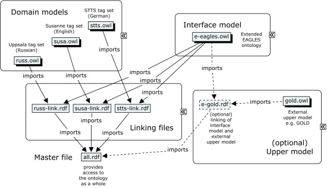

# Ontology of Linguistic Annotation: Overview (2007)

> **Note**: This document provides overview over and design decisions of the modular architecture of OLiA and the design of the OLiA Reference. However, it has been written in May 2007 and partially updated only. The original is available from the [University of Potsdam, Germany](http://nachhalt.sfb632.uni-potsdam.de/index.html), with additions taken from [another 2007 overview](http://nachhalt.sfb632.uni-potsdam.de/olia.html). Major later additions partially  addressed here include the coverage of syntax and discourse annotations that have been added in 2008, and 2014, respectively.

## Background

Concentrating on the more elementary levels of linguistic analysis such
as parts of speech and morphology, a generalization over different
terminologies applied for the annotation of the corpora hosted by three
collaborative research centers SFB 441 (Tübingen), SFB 538 (Hamburg) and
SFB 632 (Potsdam/Berlin) was developed, and later extended for NLP tools
and corpora beyond these resources. As a result, an ontology was
developed which specifies reference terminology, and the tags of the
original annotated data are linked with this reference terminology.
Besides its function in annotation documentation, the ontology can be
applied for the formulation of tag-set neutral corpus queries. For this
purpose, I developed the OntoClient, a JAVA-based query pre-processor
which translates formal ontology-based specifications into disjunctions
of concrete tags. The OntoClient serves as a pre-processor for corpus
querying languages such as ANNIS-QL and CQP, furthermore, it was applied
in the specification of tag-set independent corpus processing scripts.

The OLiA ontologies were initially developed in the context of the
project \"Sustainability of Linguistic Resources\", a collaborative
project between three German Collaborative Research Centers (SFBs), The
Collaborative Research Centres involved in the project are the SFB 538
\'Multilingualism\' at the [University of
Hamburg](https://www.uni-hamburg.de/), the [SFB 632 \'Information
Structure\'](http://www.sfb632.uni-potsdam.de/) at the [University of
Potsdam](https://www.uni-potsdam.de/) and the [Humboldt University
Berlin](https://www.hu-berlin.de/de), and the SFB 441 \'Linguistic Data
Structures\' at the [Eberhard Karls University
Tübingen](https://uni-tuebingen.de/).

The project aimed at preparing language resources to assure an
accessible dissemination and sustainable storage of linguistic corpora.
One of the main goals of the project was a practical one: resources
acquired in long-term projects situated in the three Collaborative
Research Centres have to be converted in either one or multiple formats
to be sustainably usable by researchers and applications. Furthermore,
the project developed unified methods of access for the heterogeneous
data acquired in the projects.

## Why do we need it?

One of the tasks addressed by the sustainability project was the
integration of heterogeneous terminology, especially those applied for
the annotation of existing corpora. Examples for such differences range
from minor variation in the choice of tag names (which often go
unrealized and thus, affect the reliability of broad-scale corpus
studies) to fundamental conceptual differences.

Different abbreviations for the same annotations

-   E.g. pronominal adverbs in the German de-facto standard tag set
    STTS, annotated PROAV (Stuttgart variant of STTS), PAV (Tiger
    variant of STTS), or PROP (Tübingen variant of STTS) without any
    change in meaning.

Same abbreviation for different annotations

-   E.g. the indefinite article in STTS. In Tiger-STTS, PIAT is applied
    to the indefinite article in attributive use throughout, in
    Stuttgart-STTS, PIAT is restricted to \"proper\" indefinite
    articles, i.e. those which appear as articles of indefinite
    descriptions, while the indefinite article after a definite article
    is tagged as PIDAT.

Same annotation, but different interpretation

-   E.g. the concept \"auxiliary verb\". In STTS, the tag VAFIN,
    explained as \"auxiliary verb\", is used for German haben \"to have;
    to own\" and sein \"to be; to be defined by; to exist\" in all uses.
    In the SFB632 annotation standard, however, VAUX is restricted to
    German haben and sein in auxiliary use only, while the copula sein
    \"to be equal to\" and the lexical uses of haben \"to own\" and sein
    \"to exist\" are tagged separately.

Different granularity of tag sets

-   The SFB538/E2 tag set assigns all nouns (proper nouns and common
    nouns) the same tag, the SFB632 annotation standard designed for
    typological research, differentiates 2 types of nouns (common nouns
    and proper nouns), the Penn Treebank differentiates 4 types of nouns
    (common and proper nouns in singular and plural), the SUSANNE tag
    set for English differentiates approximately 63 types of nouns based
    on semantic and morphosyntactic properties, and in the Russian
    Uppsala corpus, we find 111 different tags for common and proper
    nouns according to morphological features.

Conceptual overlap

-   In languages with grammaticalized determiners, attributive
    possessive pronouns can be regarded as determiners, as they, like an
    article, fulfil the function to mark a nominal as a noun phrase
    (resp. determiner phrase). However, in the literal sense (and
    traditional grammar), attributive possessive pronouns are
    \"pro-nouns\", i.e. replacements of names, i.e. they are
    characterized by their referentiality, and hence, pronouns. There is
    free variation among tag sets whether attributive possessive
    pronouns are regarded as determiners (ccording to their syntactic
    function), or pronouns (according to their semantic
    characterization).

All these problems are taken from the seemingly most elementary domain,
the domain of part of speech tags, however, more problems arise as soon
as morphology, syntax, or discourse phenomena are addressed.

In order to overcome such problems, terminological integration is
necessary, i.e.

-   documentation of terminological differences
-   harmonization between different terminologies

To provide an integrated access to terminologically heterogeneous
resources, it is also necessary to provide an abstract model of
linguistic reference terminology to which individual annotations refer,
a so-called \"terminological backbone\".

Classical solutions are the standardization approach and the interlingua
approach:

Standardization (cf. the
[EAGLES](http://www.ilc.cnr.it/EAGLES96/annotate/annotate.html)
recommendations on morphosyntactic annotation)

-   Definition of a reference inventory of terms which must or may be
    considered by a standard-conformant annotation scheme. Concrete
    annotations are directly mapped onto reference terms or a
    disjunction of reference terms. (Wilson and Leech 1996)

Interlingua (cf. the [AMALGAM](https://eps.leeds.ac.uk/computing)
project)

-   From different annotation schemes, or tag sets, an abstracted
    representation is derived which subsumes all possible differences
    between the participating tag sets. Whenever no direct mapping of
    annotations (e.g. X and Y) from different annotation schemes (e.g. A
    and B) is possible, all possible combinations must be represented in
    the interlingua, i.e. (A:X,B:X), (A:X,B:Y), (A:Y,B:X), (A:Y,B:Y).

Both solutions are limited in flexibility and scalability, and hence,
both approaches are applicable only within a limited domain. The
standardization approach relies on the existence of common grammatical
categories and features found in the languages for which
standard-conformant tag sets are to be developed. Otherwise, it results
in *both* 
reductionism (there are languages for which necessary distinctions cannot be expressed) and
complexity projection (there are languages for which a distinction postulated by the standard doesn't apply). However, even the sheer existence of universal
morphosyntactic categories has been questioned in typologic research,
and hence, the EAGLES-based standardization approach is unlikely to
extend beyond \"Standard Average European\" languages.

The interlingua approach, however, involves the process to construct an
interlingua between existing schemes, and is less statically than the
standardization process. However, the complexity of the interlingua
grows monotonically with every new language/tag set considered, and,
hence, the general applicability of the interlingua approach is
restricted by its limited scalability.

For this reason, the project "Sustainability of Linguistic Data" (2005-2008) has been developing an ontology of linguistic
annotations as a more flexible representation of a \"terminological
backbone\". Subsequently, this research has been transferred into an open community project by 2011, with major contributions especially provided by the Applied Computational Linguistics (ACoLi) lab of Goethe University Frankfurt, Germany.

## Design

So far, we have developed an ontology of linguistic annotations with
special consideration of part of speech and morphological annotations
existing the participating Collaborative Research Centers (Schmidt et
al. 2006, Chiarcos 2006c, Chiarcos 2006d, Chiarcos 2007).

The approach relies on the ontological reconstruction of annotation
schemes based on guidelines and additional documentation in so-called
\"annotation models\" (or \"domain models\").

Every annotation model represents one tag set or annotation scheme, with
nonterminal nodes (concepts) representing conceptual categories as
mentioned in the documentation or indicated in the document structure of
the annotation guidelines, and terminal nodes (instances) representing
concrete annotation values, or tags.

As an illustration, prototypes for the following annotation models are
available in an HTML serialization:

-   [STTS](http://nachhalt.sfb632.uni-potsdam.de/data/index.html) (POS
    tags, German) \[[owl](http://purl.org/olia/stts.owl)\] (Stuttgart, Tübingen
    and Tiger-Variant)
-   Tiger-Morphology (Morphology, POS tags inherited from STTS, German)
    \[[owl](http://purl.org/olia/tiger.owl)\]
-   [SUSANNE](http://nachhalt.sfb632.uni-potsdam.de/data/index.html)
    (POS tags with partial information about morphosyntax and lexical
    semantics, English) \[[owl](http://purl.org/olia/susa.owl)\]
-   [Uppsala](http://nachhalt.sfb632.uni-potsdam.de/data/index.html)
    (POS tags and morphology, Russian) \[[owl](http://purl.org/olia/russ.owl)\]

With respect to morphosyntactic annotations, the OLiA annotation models
currently comprise 16 annotation schemes applied to 42 languages (5
annotation models for English, 5 annotation models for German, 2
annotation models for Russian, one annotation model for Tibetan, one for
Old High German, the Connexor annotation model for 10 European
languages, one annotation model for a typologically-oriented annotation
scheme applied to 29 languages). Annotation models for syntax and
information structure/anaphora are currently under construction.

The concepts of these annotation models are linked to a common
OLiA Reference Model which is based on the EAGLES recommendations for
morphosyntax, and extended according to the needs of the participating
annotation models. 

-   [OLiA Reference Model](http://nachhalt.sfb632.uni-potsdam.de/data/index.html)
    ontology \[[owl](http://purl.org/olia/olia.owl)\]

The annotation models are then mapped onto the categories specified in
the reference model by means of conceptual subsumption (rdfs:subClassOf,
rdfs:subPropertyOf). This mapping is specified in separate \"linking
files\", thus making both the reference model and the annotation models
independent and self-contained ontologies.

-   [STTS](http://nachhalt.sfb632.uni-potsdam.de/data/index.html)
    Linking \[[owl](http://purl.org/olia/stts-link.rdf)\]
-   [SUSANNE](http://nachhalt.sfb632.uni-potsdam.de/data/index.html)
    Linking \[[owl](http://purl.org/olia/susa-link.rdf)\]
-   [Uppsala](http://nachhalt.sfb632.uni-potsdam.de/data/index.html)
    Linking \[[owl](http://purl.org/olia/russ-link.rdf)\]

The \"reference model\", however, does not specify authoritative
definitions for existing terminology, but only a fairly traditional view
on it. Hence, its primary function is not to provide prescriptive
definitions of terms, but only to provide a reference point for the
participating annotation models. Whenever a more reliable ontology of
linguistic terminology will be developed (e.g. revised versions of the
General Ontology of Linguistic Description (GOLD) or the grammis
ontology), the reference model can be linked with it in the same way as
the annotation models are linked with the reference model, and thus
mediate between such an external reference model and the annotation
models. In this sense, the reference model serves as an interface to the
annotation model, and it could be better termed \"interface model\".

# A Structured Ontology

The OLiA ontology consists of three major components, i.e.:

-   a number of domain models (OLiA Annotation Models) which are ontologies that each represent
    one annotation scheme or tag set,
-   the OLiA Reference Model, previously also referred to as "interface model" or, in its first draft version," the E-EAGLES ontology" includes
    reference definitions and thus serves as a terminological backbone
    by reference to which Annotation Model concepts are defined in a
    standardised manner, and
-   the linking between a Annotation Model and the Reference Model which is
    specified in a separate ontology (Linking Model) that is set apart from both models. 

This tripartite structure can be augmented by the optional linking of
the Reference Model with additional upper models (External Reference Models). As a result, these
upper models can be applied for the formulation of search queries as an
alternative to the reference terminology specified in the interface
model. Reference definitions retrievable from upper models to domain
models are thus mediated by the Reference Model.

We claim that this modular approach is more flexible as it allows
alternative specifications of linking and the inclusion of alternative
upper models as well as additional Annotation Models. In present-day
annotation technology, it finds a close pendant in the standoff paradigm
according to which different levels of annotation and the primary data
have to be separated from each other in order to allow for distributed
maintenance and concurrent modification. Besides these advantages, it
allows for user-specific modifications (such as the specification of
alternative upper models) without compromising the ontology as a whole.

## Drafting the OLiA Reference Model

The OLiA Reference Model provides shared terminology for linguistic annotation of various phenomena, with a focus on morphosyntax and syntax. Semantics has been excluded as we assume this is sufficiently covered by WordNet, FrameNet, etc., and should be modelled in the context of an initiative on lexical resources rather than annotated corpora. 
> **Update 2011**: Such an initiative is represented by the [W3C Community Group Ontology-Lexica (OntoLex)](https://www.w3.org/community/ontolex/).  

> **Update 2014**: We have developed a designated extension for discourse phenomena. It is, however, not directly integrated with the OLiA Reference Model.

> **Note 2022**: The intended function of the OLiA Reference Model is not to provide reference terminology, but to serve as an interface between *numerous* annotation schemes and *numerous* community-maintained reference terminology. Originally, the OLiA Reference Model has thus been referred to as *Interface Model*, but as a result of internal discussions within the Project "Sustainability of Linguistic Data" (2005-2008, U Tübingen, U Hamburg, U Potsdam), within which the OLiA Reference Model had been created, the current name was adopted as a compromise between *Interface Model* (too vague) and *Upper Model* (too prescriptive). Note that the original text of this document originates fro m 2007 and that the term *Interface Model* continues to be occasionally used below.

The core structure of the OLiA Reference Model has been inspired by the specifications of the [EAGLES initiative](https://cordis.europa.eu/project/id/LE34244), revised and extended according to the [GOLD ontology](http://linguistics-ontology.org/). The first draft of the OLiA Reference Model has thus also been referred as *E(xtended)-EAGLES* ontology. By early 2007, the first version of the E-EAGLES ontology has been implemented
using OWL/DL with Protege. Currently, it covers all the obligatory and
recommended features from the EAGLES recommendations for
morpho-syntactic annotation (Wilson and Leech 1996) plus several
categories from non-EAGLES conformant tag sets (e.g. noun classifiers).

The classes in the Reference Model are retrieved from the EAGLES
recommendations in the following way:

-   obligatory features (i.e. main word classes, such as noun, verb,
    etc.) specify top-level categories
-   recommended features which specify distinctions that are not purely
    inflectional specify more fine-grained sub-categories of top-level
    categories (e.g. the type distinction of nouns: proper nouns vs.
    common nouns)
-   recommended features which specify inflectional distinctions are
    modelled as properties

As the project data includes a MULTEXT-East-based annotation scheme for
Russian, the Uppsala scheme, the relevant definitions of MULTEXT-East
have been integrated as well.

The hierarchy of verbal classes in E-Eagles is given in Fig. 1. Note
that compared to the original EAGLES recommendations, AuxillaryVerb and
VerbalNoun are redefined in order to account for non-EAGLES conformant
tag sets.

Besides this hierarchy of classes, verbs can be further specified by
properties such as hasTense, hasAspect, hasPerson, hasNumber, hasVoice,
hasSeparability, hasReflexivity and hasGender.

## An Annotation Model: Uppsala

Annotation Models are built in a similar manner. Usually, annotation
guidelines have a document structure which specifies an otherwise
implicitly assumed hierarchical organization, thus, a similar
hierarchical structuring of concepts can be achieved.

For the tagset applied to the Uppsala corpus, the corresponding
structuring of the Annotation Model ontology is given in Fig. 2.

Again, inflectional differentiations are specified by properties in the
ontology, i.e. hasGender, hasMood, hasVoice, hasPerson, hasNumber,
hasFiniteness, hasAspect and hasTense.

Besides these abstract conceptualizations, concrete tags are integrated
as instances into the Annotation Model ontology. In Turtle pseudo-code, the definition
of the Uppsala tag `verb_finit_prt_0\_sg_neut_refl_pfipf` in the ontology
can thus be given as:

    :verb_finit_prt_0\_sg_neut_refl_pfipf a :VerbFinitPrtType; 
    :hasTense :past;  
    :hasVoice :reflexive; 
    :hasFiniteness :finite;
    :hasGender :neuter;
    :hasMood :indicative;
    :hasNumber :singular.

Further examples below adopt a slightly more compact but equivalent syntax that has been used in an ontology-based query processor operating on OLiA:

    VerbFinitPrtType and 
    hasTense(past) and 
    hasVoice(reflexive) and 
    hasFiniteness(finite) and 
    hasGender(neuter) and 
    hasMood(indicative) and 
    hasNumber(singular)

## Linking Annotation Model and Reference Model

While Annotation Model and Reference Model are specified as self-contained
ontologies in individual owl files, the linking between both is
implemented in a separate file by the rdf:description mechanism.

Basically, the linking file contains a specification of Annotation Model
classes (not instances) in terms of Reference Model classes and
properties, making up a complex inheritance structure as in Fig. 3
(restricted to subclass relationships). Note that besides the primary
classes of word types, also properties and property values from the
Annotation Model are specified as sub-properties, instances or sub-classes
of properties and classes in the Reference Model.

## A sample query

The linking file imports both the Reference Model and the corresponding
Annotation Model, and thus, it represents an integrating ontology comprising
both. If multiple Annotation Models (tag sets) are considered, the
corresponding linking files (and the ontologies they import) have to be
imported by another file, the so-called master file which represents the
ontology as a whole.

In the querying scenario, then, expressions based upon classes and
properties in the Reference Model are expanded according to the
inheritance structure within and between Reference Model and domain
models, and then evaluated.

As an example, if we are searching for past-tense reflexive verbs, a
specification like `Verb and hasTense(Past) and hasVoice(Reflexive)`
mentions the Reference Model classes `e-eagles:Verb`, `e-eagles:Past` and
`e-eagles:Reflexive` and the properties `e-eagles:hasTense` and
`e-eagles:hasVoice`. According to the interitance structure depicted in
Fig. 3, `e-eagles:Verb` expands to `russ:Verb` and further to
`russ:VerbFinitPrtType`, etc. Similarly, `e-eagles:hasTense` expands to
`russ:hasTense` etc. Thus, amongst other instances, the instance
`verb_finit_prt_0\_sg_neut_refl_pfipf` is returned.

The ontology-based query preprocessor, OntoClient, then replaces the
ontology-sensitive part of a search query by a disjunction of the tags
corresponding to the respective instances, and this modified search
query can be further processed by a corpus querying tool.

## External Reference Models: Alternative Upper Models

The very same mechanism that was used to link Annotation Model concepts with
Reference Model concepts can be employed to establish a linking between
the Reference Model and an additional upper model which provides
independent conceptualizations of linguistic terms. Candidates for such
upper models are the OntoTag ontologies (an EAGLES-based ontology of
linguistic terms with a special application to English and Iberian
languages, cf. de Cea 2004), the Data Category Registry currently
developed in the context of the Linguistic Annotation Framework (Ide et
al. 2004), or GOLD.

As illustration, we are concentrating on GOLD here, as it is a freely
available and well-recipied ontological resource with a good coverage of
non-European languages. As of January 2007, any concept in the E-EAGLES
ontology is augmented with a reference to the (E-)GOLD ontology.

Nevertheless, it seems reasonable to keep the Reference Model ontology
and the upper model apart. As the development of GOLD is still ongoing,
updated versions of GOLD could compromise the linking with the domain
models if the Annotation Models are mapped onto the upper model directly. If
both upper model and Reference Model are separated, a modification of
the upper model might force an adaption of the linking between upper
model and Reference Model, but not necessarily between the upper model
and any other existing Annotation Models.

As the upper model is linked with the Reference Model in the same way as
the Reference Model and Annotation Model, the corresponding upper model
expressions can be used for the formulation of ontology-sensitive corpus
queries.

#### Advantages of the structured approach

The crucial advantage of a structured modular ontology is its highly
flexible and user-adaptive character. As illustrated in Fig. 4, the
different components of the ontology are stored separately from each
other, and as the import mechanism relies on rdf mechanisms, the
concrete location of the corresponding files does not affect the
validity of the references. As an example, a user may prefer to use a
local variant of a certain Annotation Model, for example because his version
of the underlying annotation scheme had slightly different naming
conventions than the \"official\" Annotation Model for this annotation
scheme, for a typical example see the numerous variants of STTS which
have different tags for pronominal adverbs, e.g. PAV, PROAV and PROP. In
this case, only some instances in the Annotation Model have to be renamed,
whereas the linking can stay as it is. However, in this case the user
has to use a local copy of the linking as well which does not differ
from the \"official\" linking in any other ways than the source of the
Annotation Model to be imported.

A user thus may introduce an external upper model, he may redefine the
linking between an existing Annotation Model and the Reference Model without
affecting either of them, and he may integrate additional Annotation Models.
However, he may not modify the Reference Model. As it is the central
reference point for any linking file, this could affect the linking of
other Annotation Models and produce inconsistencies.

This modular structure is thus highly flexible and user-adaptive. A user
might even decide to disagree with the conceptualizations in the
Reference Model and develop his very own alternative, but as long as he
provides a linking between his conceptualizations and those of the
Reference Model (i.e. he implements his alternative as an upper model in
our sense), he does not have to reconsider the linking to all existing
Annotation Models.

Especially in the long run, ongoing maintenance of the ontology might
require the integration of additional upper models in order to keep
touch with the continuous process of terminological evolution, but not
the redesign of the Reference Model. The effort to have an intelligible
interface to the resources associated with certain Annotation Models is thus
reduced to the task to maintain the linking between Reference Model and
upper model.

Our implementation provides a modular view on the ontology. The ontology
consists of three principal components, the upper model presenting a
central registry of relevant terminology, several Annotation Models, each
covering the tags of one specific POS tag set, and the respective
linking between upper model and Annotation Model, which are each stored in
independent files.

To access to the ontology as a whole, an additional \"master file\" is
necessary which provides unified access to the Reference Model, the
upper model, the Annotation Models and the linking between them from
separate OWL/RDF files. As the Reference Model does not specify the
ultimate repository of linguistic terminology, additional upper models
can be integrated in this master file. As a user can define own
conceptualisations by this mechanism, the main benefit of our approach
and the development of the Reference Model lies in the fact that it is
no longer necessary to consider every tag set by its own. Instead, later
refinements are mediated by the upper model, thus the most important
achievement is that the Reference Model provides a unified access to
different tag sets for both querying and redefinition.

Besides its function in tag set neutral corpus queries and in the
theory-neutral definition of language-, project- or task-specific
annotation schemes by linking the corresponding Annotation Model with the
Reference Model, the ontology can be practically applied in the design
of tag set neutral corpus processing scripts (Krasavina et al. 2007),
or, more generally, in the field of Semantic Web applications and
ontology-based annotation (for a similar approach on a more restricted
set of languages cf. de Cea et al. 2004).

## Example ontology

An example can be downloaded [here](./img/ontologie.pdf)!

## Deep and Shallow Interoperability (2022)

**(Added 2022)**

Almost a decade after the section above on [*OLiA - Why do we need it*](#why-do-we-need-it) was drafted for the first time (in 2004, during the conceptional phase of OLiA), the [Universal Dependencies (UD) initiative](https://universaldependencies.org/) was created (in May 2014, as a GitHub organization) in an attempt to provide a "universal" (cross-linguistically applicable) **standard for dependency annotations and morphosyntax**. 

UD clearly stands out from earlier standardization/interlingua approaches in its popularity and its wide, cross-linguistic application. UD provides a middle ground between standardization and interlingua by having core vocabularies which can be extended for non-universal aspects. The UD parts of speech are a (highly reductionist) standard, but non-standardized features of morphosyntax can be preserved in the UD FEATS annotation. UD FEATS implement an interlingua approach for morphosyntactic features that is originally rooted (via MULTEXT-East) in EAGLES, and which provides a standardized core inventory ("universal standard") that can be extended with language-specific features on demand. UD dependencies are a (reductionist and theory-specific) standard, but they provide `:`-separated subtypes that are non-standardized and created on demand. 

The UD community has been (and continues to be) going through several iterations in the attempt to develop more consistent guidelines and cross-linguistically valid generalizations, e.g., with the recently introduced [amendments mechanism](https://universaldependencies.org/changes.html), and it provides a standard core vocabulary, but at the moment, neither resource-specific features nor dependency subtypes are properly harmonized with each other nor could be reduced to standard features. Likewise, the "universal" definition of categories sometimes just delegates to language-specific definitions, e.g., [VERB](https://universaldependencies.org/u/pos/VERB.html): "Modal verbs may be considered VERB or AUX, depending on their behavior in the given language. *Language-specific documentation should specify which verbs are tagged AUX in which contexts.* ...
*Depending on language and context*, [participles] may be classified as either VERB or ADJ. ... *Depending on language and context*, [some verb forms such as gerunds and infinitives] may be classified as either VERB or NOUN." (emphasis mine). However, the community is working hard on elimiting such cases and as soon as a consistent axiomatization emerges that is proven to be applicable across languages and theories, OLiA should inherit these axioms by means of equivalence links with UD as an External Reference Model. We provide UD ontologies, and these can be [dynamically generated from the UD guidelines](http://fginter.github.io/docs/), but at the moment, these are not axiomatized and linked as Annotation Models only, i.e., UD concepts are subclasses of OLiA concepts, disjunctions or intersections of OLiA concepts. 

Both OLiA and Universal Dependencies (resp., their subsequent sibling projects on [morphology](https://github.com/unimorph), [frame semantics](https://github.com/System-T/UniversalPropositions), etc.) provide solutions to the interoperability problem of linguistically annotated corpora, but there is a difference in effort and coverage in UD- and OLiA-based interoperability: 

* UD achieves interoperability by **changing** the original annotation: This can be error-prone, laborsome and irreversible. UD guarantees that every *standard* distinction is enforced on the original data (and says little about distinctions not covered by the standard).
* OLiA achieves interoperability by **formalizing and linking** the original annotation: This can also be error-prone, but it is easy to achieve, lossless and fully reversible (the original annotation is preserved). OLiA provides only (and all) distinctions that have been originally annotated. 

In other words, UD and OLiA provide different levels of interoperability that can be described as "shallow" and "deep":

- UD provides *deep* interoperability: same annotations across different languages. Establishing UD interoperability requires a validation of all annotated data if not a full reannotation.
- OLiA provides *shallow* interoperability: different annotations with the same definition across different languages. Establishing OLiA interoperability requires an understanding (and representation) of (equivalences) between the annotation and OLiA terminology.

As UD is an OLiA Annotation Model, all *UD-compliant annotations are OLiA-interoperable*, but not all OLiA-interoperable annotations are UD-compliant. But even for annotations that do not share the specific theoretical standpoint of UD, these can be compared with (and mapped to or grouped with) those from other corpora if they formalize the same distinction.

Deep (UD) interoperability entails shallow (OLiA) interoperability, or: OLiA extends the (deep) interoperability established between UD resources with a level of interoperability that these have with non-UD resources.

The situation is similar with respect to **lexical resources**, where [LexInfo](https://github.com/ontolex/lexinfo/) serves a function for machine-readable dictionaries (published as [OntoLex data](https://www.w3.org/2016/05/ontolex/)). LexInfo is a standard for grammatical (and other) features in lexical resources, so that it corresponds to the function of UD for dependency corpora. Like UD, LexInfo is integrated as an annotation model (domain model) into the OLiA architecture. The situation is somewhat different in that

- LexInfo is a native RDF vocabulary that does not require conversion, 
- it is potentially lossless (as an RDF vocabulary, it does not come with the requirement to delete the original linguistic analysis), and 
- in that the overlap is partial (aside from features of grammar and morphology, LexInfo also provides vocabulary that is specific to lexical resources and that is not covered by OLiA, e.g., metadata about or categories of lexical entries).

In comparison to UD and LexInfo, a unique contribution of OLiA is that it establishes (shallow) **interoperability between annotations and dictionaries**, so that a dictionary can be used to produce or verify corpus annotations, or that a corpus can be used to bootstrap a dictionary or quantify the distribution of certain phenomena. In parts, this is inherited from the 1998 [Expert Advisory Group on Language Engineering Standards (EAGLES)](http://www.ilc.cnr.it/EAGLES96/intro.html), as these are also (indirectly) underlying UD (FEATS annotations; partially modelled after MULTEXT-East specifications from EAGLES) and LexInfo (from ISOcat/LMF via Parole-Simple from EAGLES), but these hidden ties between UD and LexInfo are neither documented nor even widely known in either of these communities.

## Papers and Publications (2007)

> **Note**: to be updated

<table>
  <thead>
<tr>
  <th>Author</th>
  <th>Title</th>
  <th>Published in</th>
  <th>Year</th></tr></thead><tbody>
<tr>
  <td>Chiarcos, C.</td>
  <td>An Ontology of Linguistic Annotation: Word Classes and Morphology.</td>
  <td>In Proceedings DIALOG 2007, Bekasovo/Moscow, May 30 – June 3, 2007, p.630-637.</td>
  <td>2007</td></tr>
<tr>
  <td>Lehmberg, T., Chiarcos, C., Hinrichs, E., Rehm, G. & Witt, A.</td>
  <td>Collecting Legally Relevant Metadata by Means of a Decision-Tree-Based Questionnaire System.</td>
  <td>In Proceedings of Digital Humanities 2007, University of Illinois, Urbana-Champaign, USA.</td>
  <td>2007</td></tr>
<tr>
  <td>Lehmberg, T., Chiarcos, C., Rehm, G. & Witt, A.</td>
  <td>Rechtsfragen bei der Nutzung und Weitergabe linguistischer Daten.</td>
  <td>In Georg Rehm, Andreas Witt, Lothar Lemnitzer (eds.), Data Structures for Linguistic Resources and Applications. Proceedings of the Biennial GLDV Conference 2007, Tübingen/Germany, April 11-13, 2007. Gunter Narr: Tübingen, p.93-102.</td>
  <td>2007</td></tr>
<tr>
  <td>Krasavina, O., Chiarcos, C. & Zalmanov, D.</td>
  <td>Aspects of topicality in the use of demonstrative expressions in German, English and Russian.</td>
  <td>In António Branco, Tony McEnery, Ruslan Mitkov and Fátima Silva (Eds.), Proc. 6th Discourse Anaphora and Anaphor Resolution Colloquium (DAARC-2007), Lagos (Algarve)/Portugal, March 29-30, 2007, p.53-58.</td>
  <td>2007</td></tr>
<tr>
  <td>Chiarcos, C.</td>
  <td>Semimanuelle Generierung und Auswertung von Alternativentexten.</td>
  <td>In Hardarik Blühdorn, Eva Breindl, Ulrich Waßner (Eds.), Text – Verstehen. Grammatik und darüber hinaus. Institut für Deutsche Sprache. Jahrbuch 2005. De Gruyter, Berlin, New York, 2006, p.406-410.</td>
  <td>2006</td></tr>
<tr>
  <td>Chiarcos, C.</td>
  <td>Sustainability of Linguistic Data.</td>
  <td>In Proceedings of the 1st International Conference of SFB632: Information structure between linguistic theory and empirical methods. June 6-8, 2006, Potsdam, p. 161-166.</td>
  <td>2006</td></tr>
<tr>
  <td>Chiarcos, C.</td>
  <td>Avoiding Data Graveyards: Deriving an Ontology for Accessing Heterogeneous Data Collections.</td>
  <td>In Proceedings of the International Workshop „Ontologies in Text Technology (OTT'06). Approaches to Extract Semantic Knowledge from Syntactic Information“. September 28-29, 2006, Osnabrück, Germany, p.113-118.</td>
  <td>2006</td></tr>
<tr>
  <td>Chiarcos, C.</td>
  <td>An Ontology for Heterogeneous Data Collections.</td>
  <td>In Proceedings of the Int. Conference “Corpus Linguistics 2006”, October 10–14, 2006, St.-Petersburg, St.-Petersburg University Press, p. 373-380.</td>
  <td>2006</td></tr>
<tr>
  <td>Schmidt, Th., Chiarcos, C., Lehmberg, T., Rehm, G., Witt, A. & Hinrichs, E.</td>
  <td>Avoiding Data Graveyards: From Heterogeneous Data Collected in Multiple Research Projects to Sustainable Linguistic Resources.</td>
  <td>In Proceedings of the E-MELD 2006 Workshop on Digital Language Documentation: Tools and Standards – The State of the Art, Michigan State University in East Lansing, Michigan, June 2006.</td>
  <td>2006</td></tr></tbody>
</table>

